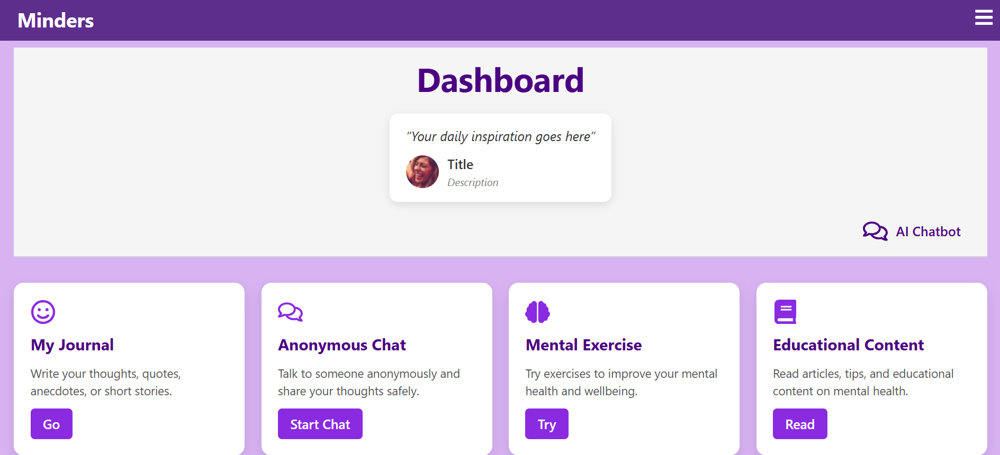
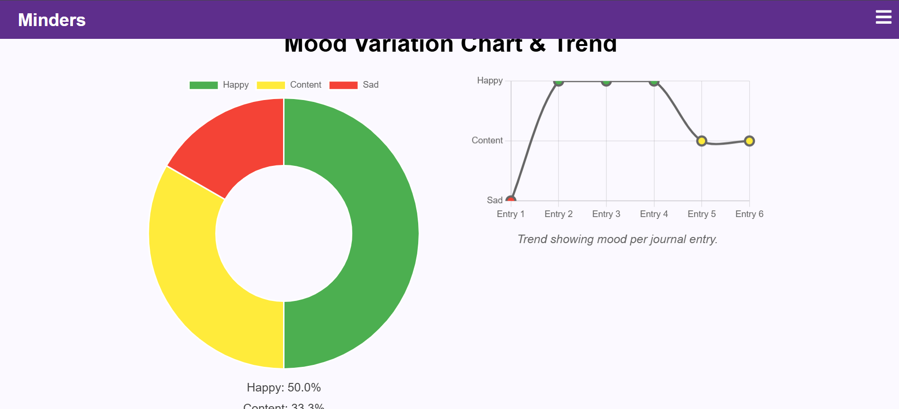
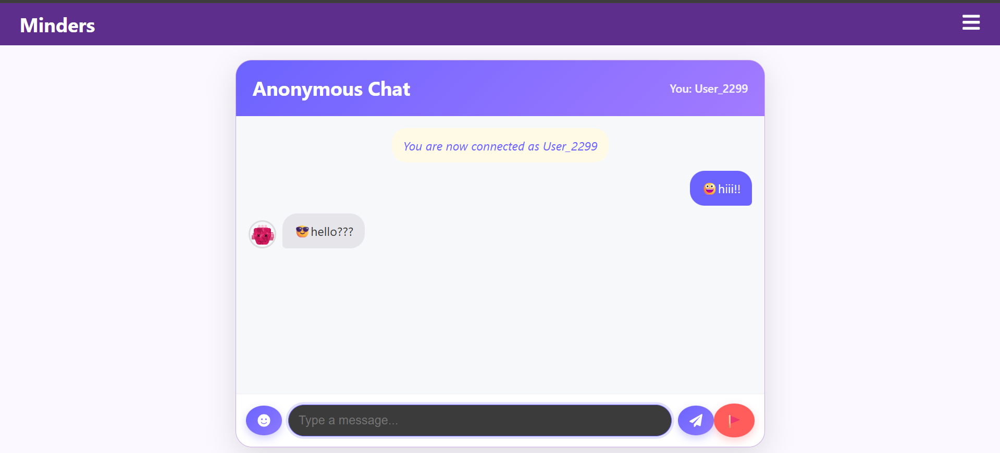
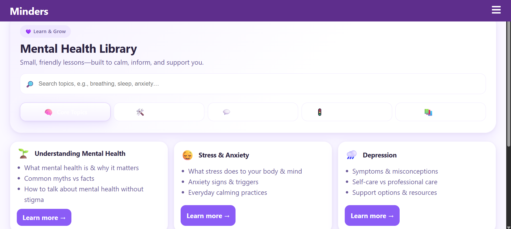

# 🧠 Minders – Your Mental Health Companion  

Minders is a **mental health app** designed to support well-being through **AI-powered features**.  
It helps users track moods, talk anonymously, journal their thoughts, and access helpful mental health resources.  

---

## 📸 Screenshots

<table>
<tr>
<td align="center">
   
  <b>Dashboard</b>
</td>
<td align="center">
   
  <b>Journal</b>
</td>
<td align="center">
   
  <b>Progress Tracker</b>
</td>
</tr>
<tr>
<td align="center">
   
  <b>Anonymous Chat</b>
</td>
<td align="center">
   
  <b>Articles</b>
</td>
</tr>
</table>

---

## ✨ Features  

- 🤖 **AI Mood Detection** – Analyze entries and detect emotional patterns.  
- 💬 **AI Chatbot for Help** – Get instant supportive responses.  
- 🕊 **Anonymous Chat** – Connect with others safely and anonymously.  
- 📓 **Journaling** – Write daily reflections and track progress.  
- 🧘 **Mental Health Exercises** – Guided activities for stress relief.  
- 📚 **Articles & Resources** – Learn more about mental health and self-care.  

---

## 🚀 Tech Stack  

**Frontend:** React, CSS  
**Backend:** Node.js, Express  
**Database:** MongoDB  
**AI Integration:** Hugging Face Inference API  
**Other Tools:** Git, GitHub, JWT Auth  

---
